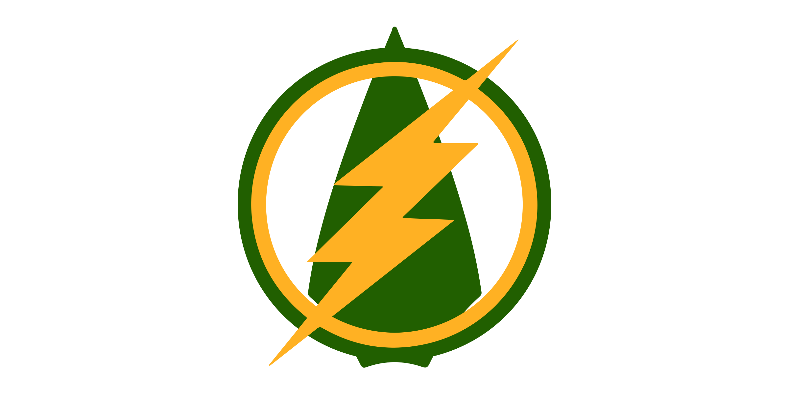

# Arrowverse TV Shows Flask App



Welcome to the Arrowverse TV Shows Flask App! This web application provides information about Arrowverse TV shows and their episodes. It utilizes a SQLite database to store show and episode data and presents it in a user-friendly interface.

## Table of Contents

- [Arrowverse TV Shows Flask App](#arrowverse-tv-shows-flask-app)
  - [Table of Contents](#table-of-contents)
  - [Features](#features)
  - [Getting Started](#getting-started)
    - [Prerequisites](#prerequisites)
    - [Installation](#installation)
  - [Usage](#usage)

## Features

- View a list of Arrowverse TV shows with details.
- Browse through episodes of different Arrowverse shows.
- Responsive design for mobile and desktop.

## Getting Started

These instructions will help you set up and run the Arrowverse TV Shows Flask App on your local machine.

### Prerequisites

- Python 3.x
- SQLite3

### Installation

1. Clone this repository to your local machine:

```bash
git clone https://github.com/your-username/arrowverse-flask-app.git
```

2. Navigate to the project directory:

```bash
cd arrowverse-flask-app
```
   
3. Create a virtual environment

```bash
python3 -m venv venv
```

a. Windows

```bash
venv\source\activate
```

b. Linux/MacOS

```bash
source venv/bin/activate
```

4. Install the required Python packages:

```bash
venv/bin/python3 -m pip install -r requirements.txt
```

## Usage

1. Initialize the SQLite database:

```bash
venv/bin/python3 datasetup.py
```

This will create the arrowverse.db SQLite database and populate it with show and episode data.

2. Start the Flask development server

```bash
venv/bin/python3 main.py
```
